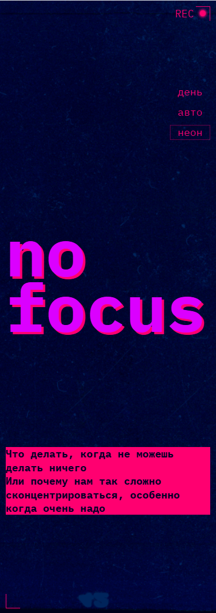
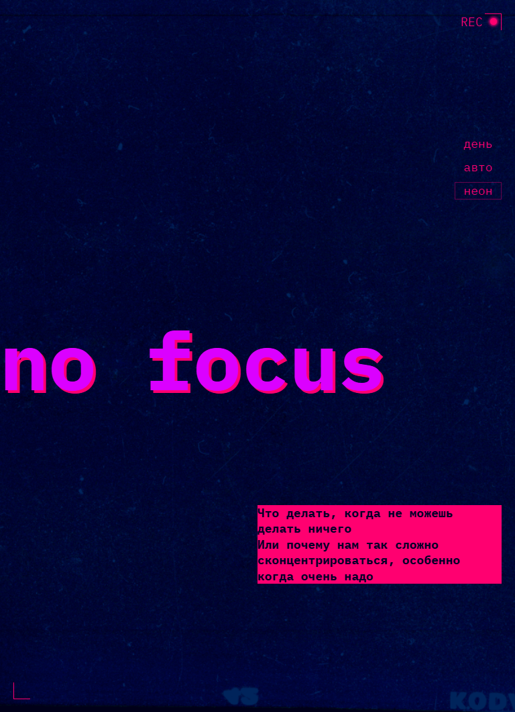
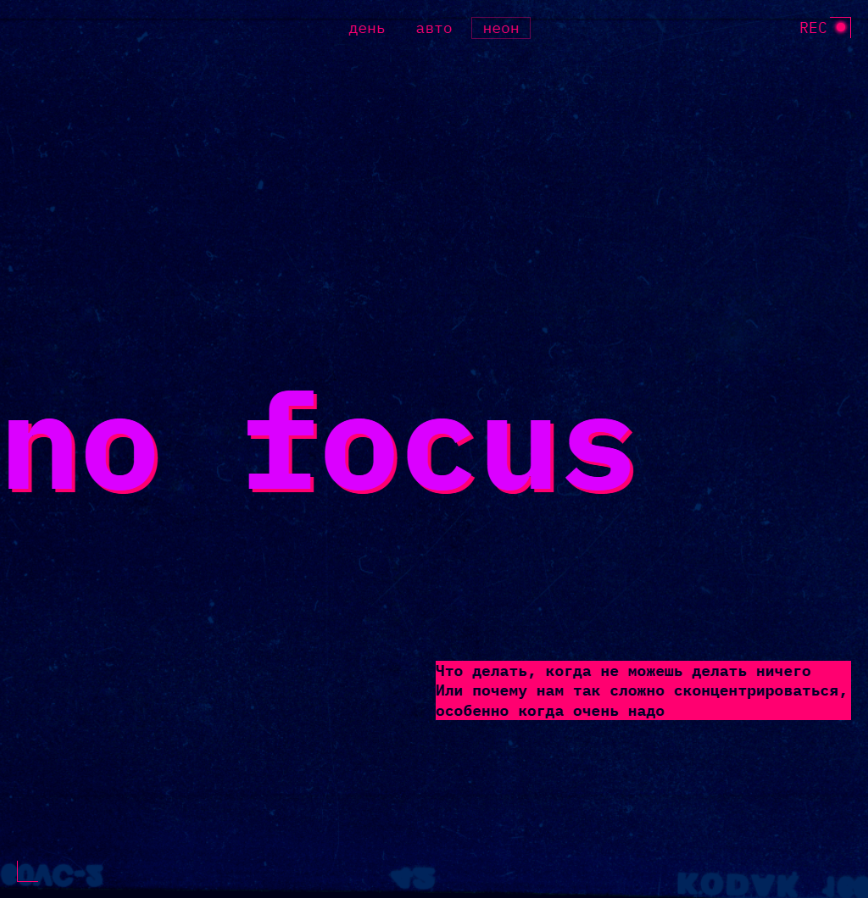

https://github.com/tiano747/slozhno-sosredotochitsya-fd/

# Практическая работа «Сложно сосредоточится» в рамках курса по HTML/CSS в Яндекс Практикум.

## Оглавление

- [Скриншоты](#скриншот)
- [Описание](#описание)
- [Автор](#автор)
- [Благодарность](#благодарность)

### Скриншоты

### Описание

NO FOCUS
Одностраничный адаптивный сайт с поддержкой светлой и темной тем про проблему сосредоточения внимания, причины снижающие концентрацию внимания и советы как концентрироваться лучше. 

## Автор

- Github - [Anatoliy Tikhonov](https://github.com/tiano747)

## Благодарность

Благодарность компании Яндекс за интересные практические работы!